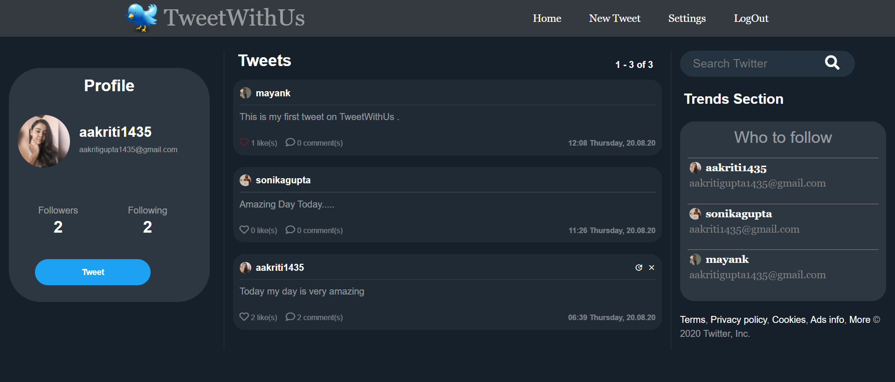
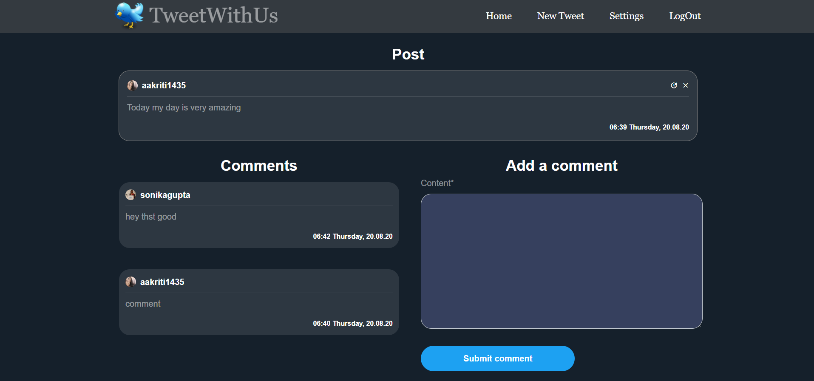
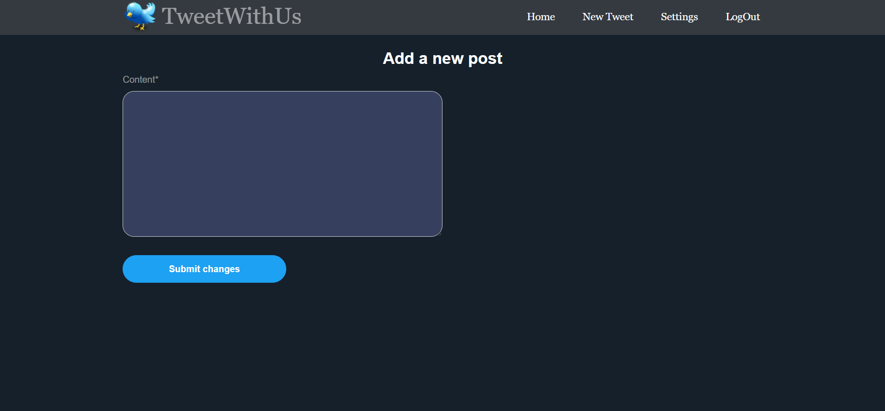
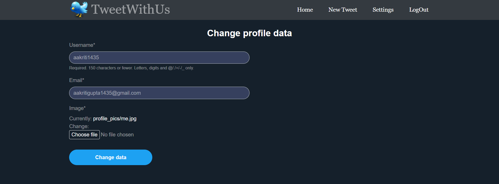

# Twitter Clone Backend Using Django
A Simple Django project to understand some basic backend functionalities of TWITTER

## How Project Looks like?
<b>Home Page</b><br>
* After Signup/Signin User will see this Home Page<br>
* Left side contains the user profile, the middle section contains all the tweets of the User and others whom the User is following and the right section contains a search bar, a trends section and a who to follow suggestions section.


<b>Tweet Details Page</b>
* Here Users can see the details of Tweet and all the comments on that Tweet as well. User can also add a Comment on the Tweet.
* User can also edit or delete his/her tweet as well


<b>Adding a New Tweet</b>


<b>Profile Settings</b>


## SETUP - How to Run the Project
1. Clone the Repository ```git clone https://github.com/aakriti1435/Twitter-Clone-Backend-Using-Django.git ```
2. Move to the Directory ```cd Twitter-Clone-Backend-Using-Django-master```
3. To Create a virtual environment run the command ```pip install virtualenv``` and then ```virtualenv nameofenvironment``` and then ```cd nameofenvironment```
4. Then to Activate the Virtual Env move to ```cd Scripts``` after that run the command ```activate.bat``` and go back to the main directory by running the command ```cd ..```
5. Then install the dependencies by running the command ```pip install -r requirements.txt```
6. For the Database run the command ```python manage.py makemigrations``` and then ```python manage.py migrate```
7. Finally to run the project run the command ```python manage.py runserver```
## 